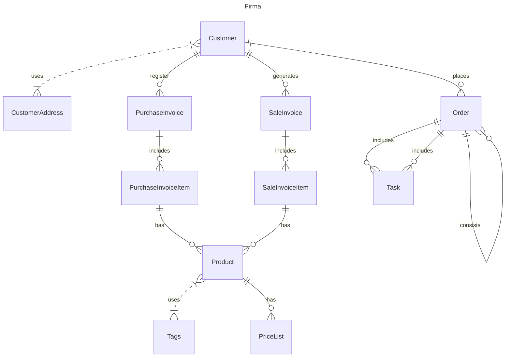

# Firma
Plan gry
Stworzę aplikację do prowadzenia małej firmy
Zakres funkcjonalności:

- Ewidencja klientów - `Customer`
- Ewidencja faktur sprzedaży
- Produkty i cennik
- Zlecenia i zadania - `Order`, `Task`
- Ewidencja faktur kosztowych
- Powiązanie kosztów że zleceniami
- Wysyłanie faktur do KSEF
- Pobieranie faktur z KSEF
- Rozponawanie faktur i paragonów zakupowych
- Drukowanie paragonu na drukarce fiskalnej
- Obsługa paragonów elektronicznych

Format MarkDown

** Struktura bazy

** Struktura klas

** Dodatkowe linki

 https://vimeo.com/669139136?share=copy  Definiowanie faktury w report designer
